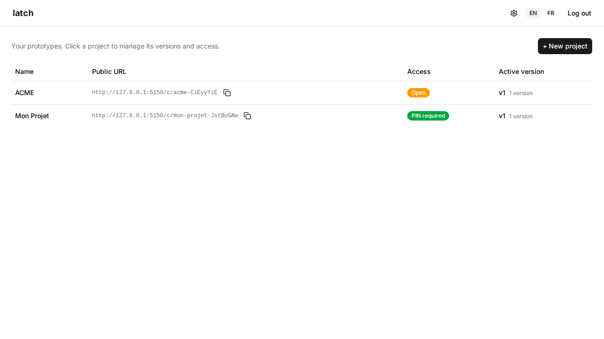
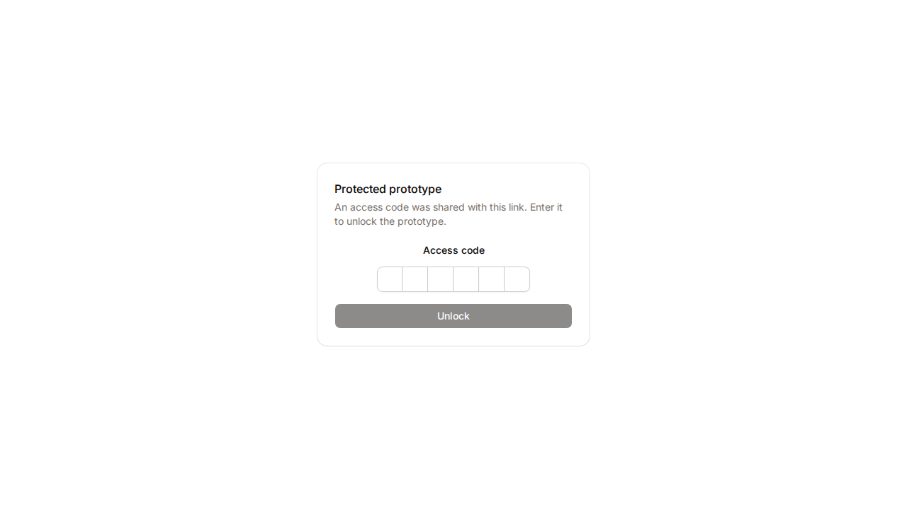

# latch

[](https://github.com/owlnext-fr/latch/actions/workflows/ci.yml)
[](https://sonarcloud.io/summary/new_code?id=owlnext-fr_latch)
[](https://sonarcloud.io/summary/new_code?id=owlnext-fr_latch)
[](#licence)

Petite app Rust qui sert des prototypes HTML mono-fichier derrière un host
contrôlé, avec versioning et code d'accès optionnel par projet. Trois surfaces
sur un seul binaire [Loco](https://loco.rs) : serving client, admin, et un
endpoint MCP que Claude appelle pour déployer.

> 📚 Documentation détaillée (quickstart approfondi, guides) : https://latch.owlnext.fr/docs *(à venir — Phase 8, Fumadocs)*

## Captures

| Liste admin | Page de déverrouillage |
|---|---|
|  |  |

## Les trois surfaces

- **Serving client** `/c/<slug>` — sert la version active d'un prototype. Projet
  libre → HTML servi directement ; projet protégé → page de déverrouillage stylée
  (PIN à 6 chiffres) puis HTML une fois le cookie posé. Tout en `Cache-Control: no-store`.
- **Admin** `/admin` — SPA React/Vite derrière une session cookie : projets,
  versions, déploiement manuel, bascule de version active, configuration des codes.
- **MCP** `/mcp` — endpoint [Model Context Protocol](https://modelcontextprotocol.io)
  appelé par Claude. Deux tools : `deploy_prototype` et `list_projects`, tous deux
  gardés par un `deploy_token`.

## Quickstart

### Docker (production)

```bash
cp .env.example .env       # puis renseigner les variables ci-dessous
docker compose up -d       # pull + run (image GHCR publique)
```

Variables **obligatoires en prod** (le boot refuse de démarrer si une manque —
fail-secure). Générer chaque secret avec `openssl rand -hex 32` :

| Variable | Rôle |
|---|---|
| `ADMIN_USER` | Identifiant du compte admin (unique). |
| `ADMIN_PASS` | Mot de passe admin (comparé à temps constant, non hashé). |
| `DEPLOY_TOKEN` | Secret validé par **tous** les tools MCP (`deploy_prototype`, `list_projects`). |
| `LATCH_PUBLIC_BASE_URL` | URL publique racine (ex. `https://latch.owlnext.fr`) — source de `allowed_hosts` et de l'URL retournée par MCP. |
| `SESSION_SECRET` | Clé HMAC du cookie de session admin (≥ 64 octets). |
| `UNLOCK_COOKIE_SECRET` | Clé HMAC du cookie de déverrouillage client (≥ 64 octets). |

Les autres clés (rate-limit, TTL, stockage, port…) ont des défauts sains — cf.
`.env.example` et [`docs/ENVIRONMENT.md`](docs/ENVIRONMENT.md).

### Dev local

```bash
# Backend — se lance DEPUIS backend/ (Loco lit ./config relativement au CWD).
cd backend && cargo loco start        # app + auto-migrate au boot (port 5150)

# Frontend — dans un autre terminal
cd frontend && pnpm install && pnpm dev   # React/Vite HMR (port 5173)
```

## Connecter Claude (MCP)

1. Dans l'admin, ouvrir **Settings** : y figurent `mcp_url`
   (`<LATCH_PUBLIC_BASE_URL>/mcp`) et le `deploy_token` (masqué, copiable).
2. Côté Claude → Connecteurs MCP : renseigner l'URL MCP. Pas d'OAuth ni de header
   d'auth — l'auth vit dans l'argument `deploy_token` de chaque tool.
3. Tester avec `list_projects(deploy_token=<valeur>)`, puis déployer via
   `deploy_prototype(slug, html, deploy_token)`.

→ doc détaillée *(à venir — Phase 8)*.

## Architecture

Archi en couches / hexagonale légère sur squelette Loco :

- **Cœur** (`backend/src/services/`) — agnostique HTTP : toute la logique métier,
  sans `axum` ni `loco_rs`. Il suppose son appelant déjà autorisé.
- **Adaptateurs entrants** (fins) — contrôleurs web (`controllers/`), tools MCP
  (`mcp/`), serving client (`serve.rs`) : ils traduisent une requête en appel de
  service et portent toute la décision d'auth.
- **Adaptateurs sortants** — SeaORM (projets/versions) et le trait `Storage`
  (fichiers HTML, injectable).

Invariants de sécurité (non négociables, testés — le build casse s'ils sont violés) :

- **Aucune réponse ne renvoie de hash**, jamais (ni web, ni MCP).
- Le **PIN en clair** n'apparaît **que sur le détail d'un projet** — jamais dans
  une liste, jamais via MCP.
- Le **`deploy_token` est validé sur tous les tools MCP**, lecture comprise.

Le contrat fait loi → [`docs/contrat-deploy.md`](docs/contrat-deploy.md).

## Stack

- **Backend** : Loco (axum) + SeaORM + SQLite (`bundled`) · `rmcp` ≥ 1.4
  (transport Streamable HTTP).
- **Frontend** : React + Vite + TypeScript + pnpm · TanStack Router/Query ·
  shadcn/ui (Radix, stone oklch) + Tailwind v4 · react-hook-form/zod ·
  react-i18next (FR/EN) · sonner · openapi-fetch/openapi-typescript (client typé
  depuis `openapi.json`).

## Développement & Qualité

```bash
# Backend (depuis la racine)
cargo fmt --all && cargo clippy --all-targets -- -D warnings
cargo nextest run            # tests unit + intégration + MCP
cargo deny check             # licences + advisories

# Frontend (depuis frontend/)
pnpm lint && pnpm typecheck && pnpm test    # ESLint + tsc + Vitest (MSW)
pnpm exec playwright test                    # e2e navigateur réel
```

Couverture **new-code ≥ 80 %** : la gate SonarCloud `new_coverage ≥ 80 %` sur le
code neuf est **bloquante** en CI (pas d'image publiée si elle échoue). Détails et
recette de scan local → [`docs/BOOTSTRAP.md`](docs/BOOTSTRAP.md).

## Déploiement

Image multi-stage publiée sur **GHCR public** (`ghcr.io/owlnext-fr/latch`) — pas de
`docker login` au pull. Déploiement manuel sur la box :

```bash
./deploy.sh                  # docker compose pull + up -d + image prune
```

L'image ne contient **aucun secret** : tout est injecté par `.env` au runtime.
Tags d'image et pin de version (`LATCH_IMAGE_TAG`) → [`docs/BOOTSTRAP.md §7-8`](docs/BOOTSTRAP.md).

## Sécurité & confidentialité

- L'app sert `robots.txt` (`Disallow: /`) et pose l'en-tête
  `X-Robots-Tag: noindex, nofollow` — les crawlers honnêtes n'indexent rien.
- Le **vrai gating reste l'auth** : session admin, `deploy_token` MCP, code par
  projet. Un proto sans code reste joignable par quiconque a l'URL (slug à suffixe
  aléatoire de 8 chars base62, quasi non-énumérable) — compromis assumé, faible enjeu.

## Licence

Dual-license [MIT](LICENSE-MIT) OU [Apache-2.0](LICENSE-APACHE), au choix.
Historique des versions : [`CHANGELOG.md`](CHANGELOG.md).
